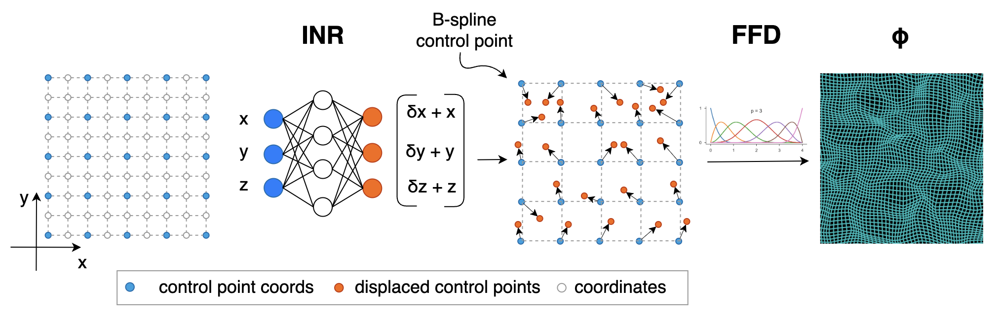

# SINR: Spline-enhanced implicit neural representation for multi-modal registration (MIDL 2024)


Welcome!

This repository contains code for the Spline-enhanced Implicit Neural Representation (SINR) framework presented in the paper ([submitted to MIDL 2024](https://openreview.net/forum?id=V5XDYSRcQP)):




## Installation
1. Clone this repository
2. In a fresh Python 3.7.x virtual environment, install dependencies by running:
 ```
 pip install -r <path_to_cloned_repository>/requirements.txt
 ```

## Fit

To run the code please use the following command:

   ```
   python fit.py
   ```

## Data
We believe in reproducibility and open datasets in research. Unfortunately, we are not allowed to share the original or processed data that we used in the paper directly due to limitations on redistribution put in place by the original data distributor. But you can apply to download these data at:
- [CamCAN](https://camcan-archive.mrc-cbu.cam.ac.uk/dataaccess/)

## Contact Us
If you have any question or need any help running the code, feel free to open an issue or email us at:
[vasiliki.sideri-lampretsa@tum.de](mailto:vasiliki.sideri-lampretsa@tum.de)
